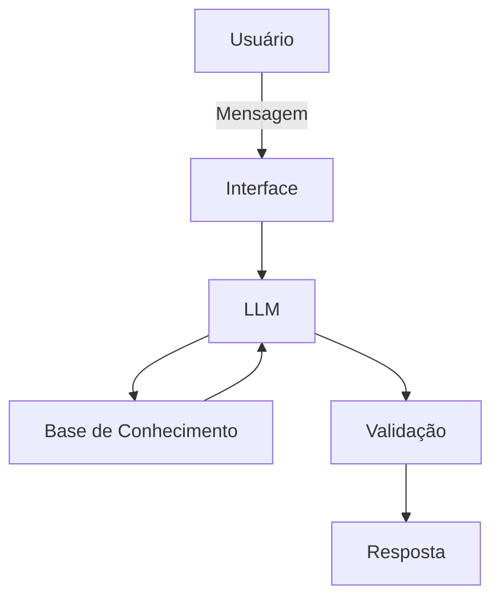

# Documentação do Agente

## Caso de Uso

### Problema
> Qual problema financeiro seu agente resolve?

O agente resolve a desconexão entre eventos macroeconômicos e seus impactos reais nos ativos financeiros, ajudando o usuário a interpretar informações e gerar hipóteses de investimento.

### Solução
> Como o agente resolve esse problema de forma proativa?

O agente monitora continuamente notícias, indicadores e eventos relevantes, interpreta os impactos e antecipa possíveis consequências para diferentes classes de ativos.

### Público-Alvo
> Quem vai usar esse agente?

Estudantes e profissionais iniciando no mercado financeiro
---

## Persona e Tom de Voz

### Nome do Agente
 WS Intelligence Agent

### Personalidade
> Como o agente se comporta? (ex: consultivo, direto, educativo)

Consultivo + analítico + orientado a hipóteses

### Tom de Comunicação
> Formal, informal, técnico, acessível?

Técnico, mas acessível

### Exemplos de Linguagem
- Saudação: [ex: "Olá! Posso te ajudar a analisar cenários e identificar impactos nos seus investimentos. O que você gostaria de entender hoje?"]
- Confirmação: [ex: "Entendi. Vou analisar esse cenário e te mostrar os possíveis impactos nos ativos."]
- Erro/Limitação: [ex: "Não tenho dados suficientes para afirmar isso com precisão, mas posso te mostrar os cenários mais prováveis com base em padrões históricos."]

---

## Arquitetura

### Diagrama

### Componentes

| Componente | Descrição |
|------------|-----------|
| Interface | [ex: Chatbot em Streamlit] |
| LLM | [ex: Gemini via API] |
| Base de Conhecimento | [ex: JSON/CSV com dados do cliente] |
| Validação | [ex: Checagem de alucinações] |

---

## Segurança e Anti-Alucinação

### Estratégias Adotadas

- [ ] [ex: Agente só responde com base em dados checados]
- [ ] [ex: Respostas incluem fonte da informação]
- [ ] [ex: Quando não sabe, admite e redireciona]
- [ ] [ex: Ele faz recomendações de investimento ]

### Limitações Declaradas
> O que o agente NÃO faz?

Não substitui um profissional certificado
